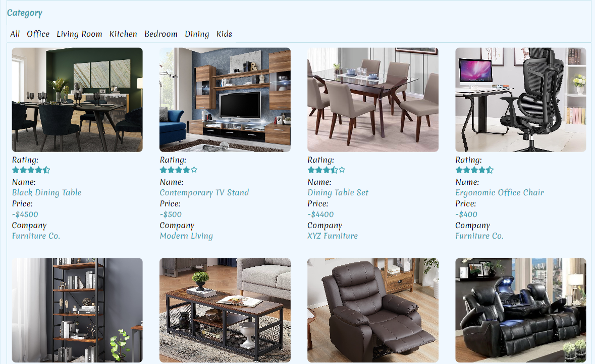

# The Furniture Shop

Welcome to The Furniture Shop, a personal MERN (MongoDB, Express, React, Node.js) project designed to provide you with a unique online furniture shopping experience. The Furniture Shop combines the power of modern web technologies with the beauty and functionality of exquisite furniture, all in one convenient platform.

## Tech Stack

**Client:** React, Styled-Components

**Server:** Node, Express ,MongoDB

## Run Locally

Clone the project

```bash
  git clone git@github.com:Armaan-Singh-Dhillon/Furniture-Store.git
```

Go to the project directory


```bash
  npm install
  npm run vercel-postbuild
```

Start the server

```bash
 nodemon server.js
```

## Project Deployed On Vercel

To access this project

[Click Here To See The Deployed Project](https://furniture-store-96m5vuu9v-armaan-singh-dhillon.vercel.app/products/)

## Screenshots





## Color Reference

| Color            | Hex                                                              |
| ---------------- | ---------------------------------------------------------------- |
| Background Color |  #F0F8FF |
| Borders          |  #39A1AE |
| Text Color       |  #000          |

## Features

- Authentication: Implement user authentication to allow secure access to the application using features such as sign-up, login, and logout functionality.
- JWT Tokens: Utilize JSON Web Tokens (JWT) for authentication and authorization, ensuring secure and stateless communication between the client and server.
- Express for Routing Middlewares: Utilize Express.js, a flexible Node.js web application framework, to define and handle routes and middleware functions for authentication, authorization, and data validation.
- Context API: Utilize React's Context API to manage and share application state across components, enabling efficient data flow and reducing prop drilling.
- State for Loading: Implement state management to handle loading states, ensuring a seamless user experience by displaying loading indicators during data fetching or processing.
- Axios: Use Axios, a popular JavaScript library, to send HTTP requests from the client-side application to the server, facilitating seamless communication and data retrieval.
- Request and CRUD: Implement Create, Read, Update, and Delete (CRUD) operations to interact with the MongoDB Atlas database. This allows for efficient data management and manipulation within the application.

## Developer

- [@Shaik Varfana Madam](https://github.com/varfana)

## Support

For support, email shaikvarfana786@gmail.com
